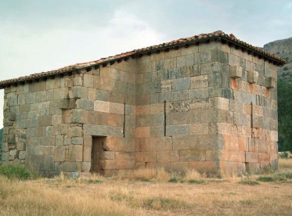

# Obras

Los monumentos de arquitectura que hoy se consideran como visigodos en nuestra
península aunque hayan sufrido posteriores y variadas restauraciones o solo se
conserven ruinas de ellos, se reducen a los siguientes:

* La ermita de Santa María, situada en la localidad burgalesa de Quintanilla de las
Viñas.

* La iglesia de San Juan, en Baños de Cerrato (Palencia) de tipo basilical latino.

* Las iglesias de San Martín y de Santa Comba de Bande, ambas de Orense y de tipo
más o menos bizantino en forma de cruz griega.

* La iglesia de San Pedro de la Nave (Zamora), como participando de uno y otro tipo.

* La capilla de San Fructuoso de Montelius en Braga, Portugal.

* La iglesia de Santa Lucía del Trampal en Alcuéscar, Cáceres.

La Iglesia de Santa María de Melque de San Martín de Montalbán (Toledo).

