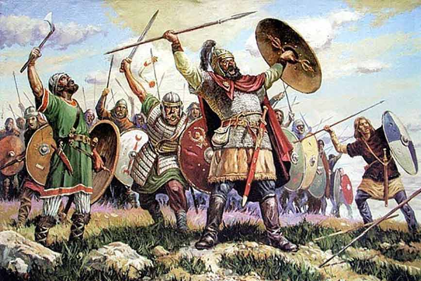

# Visigodos

**Los visigodos** fueron distintos **pueblos bárbaros** que, sin encontrar oposición, se
adentraron en **Hispania**. Este hecho coincide con el **declive del Imperio romano**. Se estableció 
un tratado en el cual se disponía que los visigodos se asentaran en el sur de
la Galia y controlaran algunos territorios en Hispania.

## Indice

1. [Epoca](Epoca.md)
2. [Arquitectura](Arquitectura.md)
3. [Obras mas significativas](Obras.md)

## Referencia

[National Geographic España](https://historia.nationalgeographic.com.es/temas/visigodos)
